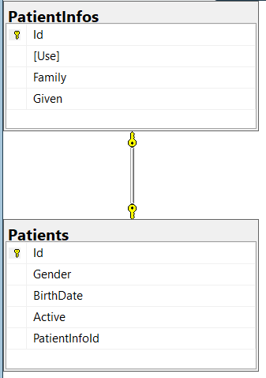

# Patient Solution

## Содержание
1. [Описание проекта](#описание-проекта)
2. [Структура проекта](#структура-проекта)
3. [Структура базы данных](#структура-базы-данных)
4. [API Методы](#api-методы)
    - [Базовые CRUD операции](#базовые-crud-операции)
    - [Дополнительные методы](#дополнительные-методы)
    - [Параметры пагинации](#параметры-пагинации)
    - [Заголовки ответа](#заголовки-ответа)
    - [FHIR-форматы поиска](#fhir-форматы-поиска)
5. [PatientConsoleApplication](#patientconsoleapplication)
    - [Назначение](#назначение)
    - [Функциональность](#функциональность)
    - [Генерируемые данные](#генерируемые-данные)
    - [Запуск генератора](#запуск-генератора)
6. [PatientAPI.Tests](#patientapitests)
    - [Назначение](#назначение-1)
    - [Используемые технологии](#используемые-технологии)
    - [Тестируемые сценарии](#тестируемые-сценарии)
    - [Запуск тестов](#запуск-тестов)
7. [Запуск проектов](#запуск-проектов)
    - [Запуск PatientAPI](#запуск-patientapi)
    - [Запуск PatientConsoleApplication](#запуск-patientconsoleapplication)
    - [Запуск тестов](#запуск-тестов-1)
8. [Доступ к сервисам](#доступ-к-сервисам)
9. [Postman коллекция](#postman-коллекция)
    - [Основные методы](#основные-методы)
    - [Поиск по дате рождения](#поиск-по-дате-рождения-fhir)
    - [Дополнительные методы](#дополнительные-методы-1)
10. [Справочники](#справочники)
11. [Пример JSON](#пример-json-для-создания-пациента)
12. [Валидация данных](#валидация-данных)
13. [Docker конфигурация](#docker-конфигурация)
14. [Тестирование](#тестирование)
15. [Используемые технологии](#используемые-технологии)

---

## Описание проекта

**Patient Solution** - это RESTful веб-сервис для управления данными пациентов (рожденные в роддоме дети) и консольное приложение для демонстрации работы API. Проект разработан на ASP.NET Core 6 с использованием Entity Framework Core и запускается в Docker-контейнерах (API и база данных).

### Основные возможности:
- CRUD операции для сущности Patient
- Поиск пациентов по дате рождения с поддержкой FHIR-формата (9 операторов: eq, ne, lt, gt, le, ge, sa, eb, ap)
- Валидация данных по справочникам (Gender, Active)
- Пагинация с заголовками X-Total-Count, X-Limit, X-Offset
- Консольный генератор для создания 100 тестовых пациентов
- Docker-контейнеризация (API + SQL Server)
- Swagger документация
- Postman коллекция для тестирования
- Unit-тесты с использованием NUnit и InMemory Database

[🔝 к оглавлению](#содержание)

---

## Структура проекта

Проект состоит из трех основных частей:

### 1. **PatientAPI** - Веб-сервис

```
PatientAPI/
├── Controllers/
│   └── PatientsController.cs      # REST API контроллер
├── Models/
│   ├── Patient.cs                 # Модель пациента
│   └── PatientInfo.cs             # Модель информации о пациенте
├── Data/
│   └── AppDbContext.cs            # Контекст базы данных
├── Program.cs                     # Точка входа и настройка сервисов
├── appsettings.json               # Конфигурация приложения
├── Dockerfile                     # Docker образ для API
└── docker-compose.yml             # Оркестрация контейнеров
```

**Назначение**: Веб-сервер, обрабатывающий HTTP запросы и взаимодействующий с базой данных.

### 2. **PatientConsoleWithoutDocker** - Консольный генератор

```
PatientConsoleWithoutDocker/
├── Program.cs                         # Генератор тестовых данных
└── PatientConsoleWithoutDocker.csproj # Конфигурация проекта
```

**Назначение**: Утилита для автоматической генерации 100 тестовых пациентов через API.

### 3. **PatientAPI.Tests** - Модульные тесты

```
PatientAPI.Tests/
├── PatientsControllerTests.cs      # Тесты контроллера
├── FhirDateParserTests.cs          # Тесты парсера FHIR дат
├── TestDbContextFactory.cs         # Фабрика для InMemory БД
└── Usings.cs                       # Глобальные using
```

**Назначение**: Модульные тесты для проверки работоспособности API с использованием InMemory Database.

[🔝 к оглавлению](#содержание)

---

## Структура базы данных

### Модель Patient
```sql
CREATE TABLE Patients (
    Id UNIQUEIDENTIFIER PRIMARY KEY,
    PatientInfoId UNIQUEIDENTIFIER NOT NULL,
    Gender NVARCHAR(20),
    BirthDate DATETIME2 NOT NULL,
    Active BIT NOT NULL,
    FOREIGN KEY (PatientInfoId) REFERENCES PatientInfos(Id) ON DELETE CASCADE
)
```

### Модель PatientInfo
```sql
CREATE TABLE PatientInfos (
    Id UNIQUEIDENTIFIER PRIMARY KEY,
    Use NVARCHAR(50),
    Family NVARCHAR(100) NOT NULL,
    Given NVARCHAR(MAX) -- хранится как JSON
)
```



### Связи:
- **One-to-One**: Каждый пациент имеет одну запись с именем (каскадное удаление)

> **Важно**: База данных создается автоматически при первом запуске API. 
> EF Core использует `EnsureCreated()` для создания БД и таблиц на основе моделей.
> Миграции не требуются, все работает "из коробки".

[🔝 к оглавлению](#содержание)

---

## API Методы (PatientAPI)

### Базовые CRUD операции

| Метод | Endpoint | Описание |
|-------|----------|----------|
| GET | `/api/patients` | Получение всех пациентов с пагинацией |
| GET | `/api/patients/{id}` | Получение пациента по ID |
| POST | `/api/patients` | Создание нового пациента |
| PUT | `/api/patients/{id}` | Полное обновление пациента |
| PATCH | `/api/patients/{id}` | Частичное обновление (переключение active) |
| DELETE | `/api/patients/{id}` | Удаление пациента |

### Дополнительные методы

| Метод | Endpoint | Описание |
|-------|----------|----------|
| GET | `/api/patients/search` | Поиск пациентов по дате рождения (FHIR) |
| GET | `/api/patients/count` | Получение количества пациентов |
| GET | `/api/patients/info` | Получение справочников и версии API |

### Параметры пагинации для GET /api/patients

| Параметр | Тип | Описание | Пример |
|----------|-----|----------|---------|
| limit | int | Лимит записей (1-1000, по умолч. 100) | `?limit=50` |
| offset | int | Смещение для пагинации | `?offset=100` |

### Заголовки ответа для пагинации

| Заголовок | Описание |
|-----------|----------|
| X-Total-Count | Общее количество записей |
| X-Limit | Запрошенный лимит |
| X-Offset | Запрошенное смещение |

### FHIR-форматы для поиска по дате рождения (endpoint: `/api/patients/search`)

| Префикс | Значение | Пример | Описание |
|---------|----------|--------|----------|
| eq | равно | `?birthDate=eq2024-01-13` | Точное совпадение даты |
| ne | не равно | `?birthDate=ne2024-01-13` | Все кроме указанной даты |
| lt | меньше | `?birthDate=lt2024-01-01` | Даты до указанной |
| gt | больше | `?birthDate=gt2024-01-01` | Даты после указанной |
| le | меньше или равно | `?birthDate=le2024-01-01` | Даты до и включая указанную |
| ge | больше или равно | `?birthDate=ge2024-01-01` | Даты после и включая указанную |
| sa | starts after | `?birthDate=sa2024-01-01` | Даты строго после указанной |
| eb | ends before | `?birthDate=eb2024-01-01` | Даты строго до указанной |
| ap | approximately | `?birthDate=ap2024-01-13` | Даты в пределах +/- 1 дня |

[🔝 к оглавлению](#содержание)

---

## PatientConsoleApplication - Консольный генератор

### Назначение
Консольное приложение для автоматического заполнения базы данных тестовыми пациентами.

### Функциональность
- Генерирует до 100 уникальных пациентов (проверяет текущее количество)
- Использует реалистичные данные (имена, фамилии, отчества с учетом пола)
- Работает в два потока для ускорения генерации
- Проверяет доступность API перед началом работы
- Интерактивное меню с несколькими режимами:
  - Автоматическое заполнение
  - Заполнение из JSON-файла
  - Ручной ввод данных
  - Просмотр текущего количества записей
  - Проверка подключения к API

### Генерируемые данные
- **Мужские имена**: Иван, Петр, Сергей, Алексей, Дмитрий, Андрей, Михаил, Николай, Александр, Владимир
- **Женские имена**: Анна, Мария, Елена, Ольга, Наталья, Екатерина, Татьяна, Ирина, Светлана, Юлия
- **Фамилии**: Иванов/Иванова, Петров/Петрова, Сидоров/Сидорова и др.
- **Возраст**: от 18 до 80 лет
- **Пол**: male, female, other, unknown
- **Активность**: случайный выбор true/false

### Запуск генератора
```bash
cd PatientConsoleWithoutDocker
dotnet run
```

[🔝 к оглавлению](#содержание)

---

## PatientAPI.Tests - Модульные тесты

### Назначение
Проект с модульными тестами для проверки работоспособности API.

### Используемые технологии
- **NUnit** - фреймворк для тестирования
- **Moq** - создание mock-объектов
- **Microsoft.EntityFrameworkCore.InMemory** - InMemory база данных для тестов
- **FluentAssertions** - удобные assertions (опционально)

### Тестируемые сценарии

#### Контроллер (37 тестов):
- **GET /api/patients** - проверка пагинации и валидации параметров
- **GET /api/patients/search** - проверка всех 9 FHIR операторов
- **GET /api/patients/{id}** - получение по ID (успех/неудача)
- **GET /api/patients/count** - подсчет количества записей
- **POST /api/patients** - создание пациента (валидация данных)
- **PUT /api/patients/{id}** - обновление пациента
- **PATCH /api/patients/{id}** - переключение статуса активности
- **DELETE /api/patients/{id}** - удаление пациента
- **GET /api/patients/info** - получение справочников

#### Парсер FHIR дат (14 тестов):
- Проверка всех префиксов (eq, ne, lt, gt, le, ge, sa, eb, ap)
- Обработка некорректных форматов
- Обработка дат без префикса

### Запуск тестов

#### Через терминал:
```bash
cd PatientAPI.Tests
dotnet test
```

#### Через Visual Studio:
- **Test → Test Explorer** → Run All

[🔝 к оглавлению](#содержание)

---

## Запуск проектов

> **Важно**: Все команды выполняются из корневой папки решения `C:\Users\user\source\repos\PatientSol\`

### Запуск PatientAPI (веб-сервис)

#### Вариант 1: Через Docker Compose (согласно технических требований)
```bash
cd PatientAPI
docker-compose up --build
```

#### Вариант 2: Локальный запуск
```bash
cd PatientAPI
dotnet restore
dotnet run
```
API будет доступен по адресу: http://localhost:5000

### Запуск PatientConsoleApplication (генератор данных)
```bash
cd PatientConsoleWithoutDocker
dotnet run
```

### Запуск тестов
```bash
cd PatientAPI.Tests
dotnet test
```

[🔝 к оглавлению](#содержание)

---

## Доступ к сервисам

| Сервис | URL / Строка подключения | Порт |
|--------|--------------------------|------|
| PatientAPI | http://localhost:5000 | 5000 |
| Swagger UI | http://localhost:5000/swagger | 5000 |
| SQL Server | `Server=localhost,1433;Database=PatientDb;User Id=sa;Password=YourStrong!Password123;TrustServerCertificate=True;` | 1433 |

[🔝 к оглавлению](#содержание)

---

## Postman коллекция

В проекте включена Postman коллекция `PatientCollection.postman_collection.json` со всеми методами API.
Файл находится в корневой папке проекта `C:\Users\user\source\repos\PatientSol\`.

### Основные методы:
- **1. Получение всех пациентов (с пагинацией)** - GET /api/patients?limit=10&offset=0
- **2. Получение информации об API** - GET /api/patients/info
- **3. Получение пациента по ID** - GET /api/patients/{id}
- **4. Создание нового пациента** - POST /api/patients
- **5. Обновление пациента** - PUT /api/patients/{id}
- **6. Удаление пациента** - DELETE /api/patients/{id}

### Поиск по дате рождения (FHIR):
- **7.1 eq (равно)** - GET /api/patients/search?birthDate=eq2024-01-13
- **7.2 ne (не равно)** - GET /api/patients/search?birthDate=ne2024-01-13
- **7.3 lt (меньше)** - GET /api/patients/search?birthDate=lt2024-01-01
- **7.4 gt (больше)** - GET /api/patients/search?birthDate=gt2024-01-01
- **7.5 le (меньше или равно)** - GET /api/patients/search?birthDate=le2024-01-01
- **7.6 ge (больше или равно)** - GET /api/patients/search?birthDate=ge2024-01-01
- **7.7 sa (starts after)** - GET /api/patients/search?birthDate=sa2024-01-01
- **7.8 eb (ends before)** - GET /api/patients/search?birthDate=eb2024-01-01
- **7.9 ap (approximately)** - GET /api/patients/search?birthDate=ap2024-01-13
- **7.10 без префикса (по умолчанию eq)** - GET /api/patients/search?birthDate=2024-01-13

### Дополнительные методы:
- **8. Получение количества пациентов** - GET /api/patients/count
- **9. Получение количества активных пациентов** - GET /api/patients/count?active=true
- **10. Переключение статуса активности (PATCH)** - PATCH /api/patients/{id}

[🔝 к оглавлению](#содержание)

---

## Справочники

### Gender
```json
["male", "female", "other", "unknown"]
```

### Active
```json
[true, false]
```

[🔝 к оглавлению](#содержание)

---

## Пример JSON для создания пациента

```json
{
  "name": {
    "id": "3fa85f64-5717-4562-b3fc-2c963f66afa6",
    "use": "official",
    "family": "Иванов",
    "given": ["Иван", "Иванович"]
  },
  "gender": "male",
  "birthDate": "2024-01-13T18:25:43",
  "active": true
}
```

[🔝 к оглавлению](#содержание)

---

## Валидация данных

API обеспечивает многоуровневую валидацию:

1. **Обязательные поля**: name.family, birthDate
2. **Справочники**: gender, active (только разрешенные значения)
3. **Длина полей**: защита от DoS-атак (max 100 символов для family, 50 для given)
4. **Формат данных**: FHIR для дат (9 операторов), regex для имен (только буквы, пробелы, дефисы)
5. **Логические проверки**: дата не в будущем, возраст не более 150 лет
6. **Защита от SQL-инъекций**: через Entity Framework Core
7. **Пагинация**: ограничение лимита (1-1000), проверка смещения (offset >= 0)

[🔝 к оглавлению](#содержание)

---

## Docker конфигурация (PatientAPI)

### Состав контейнеров:
- **db**: SQL Server 2022
- **patientapi**: ASP.NET Core Web API

### Сеть:
- **patient_network**: bridge network для связи контейнеров

### Тома:
- **sql_data**: персистентное хранение данных БД

### Запуск:
```bash
cd PatientAPI
docker-compose up --build
```

[🔝 к оглавлению](#содержание)

---

## Тестирование

### Swagger UI
Откройте http://localhost:5000/swagger для интерактивного тестирования API

### Postman
Импортируйте `PatientCollection.postman_collection.json` в Postman

### Модульные тесты
```bash
cd PatientAPI.Tests
dotnet test
```

### Консольный генератор
```bash
cd PatientConsoleWithoutDocker
dotnet run
```
Сгенерирует тестовых пациентов (до 100 записей)

[🔝 к оглавлению](#содержание)

---

## Используемые технологии

- **.NET 6** - платформа разработки
- **ASP.NET Core** - веб-фреймворк
- **Entity Framework Core 6** - ORM
- **SQL Server** - база данных
- **Docker** - контейнеризация
- **Swagger** - документация API
- **NUnit** - модульное тестирование
- **Moq** - mocking для тестов
- **Postman** - тестирование API

[🔝 к оглавлению](#содержание)

---
